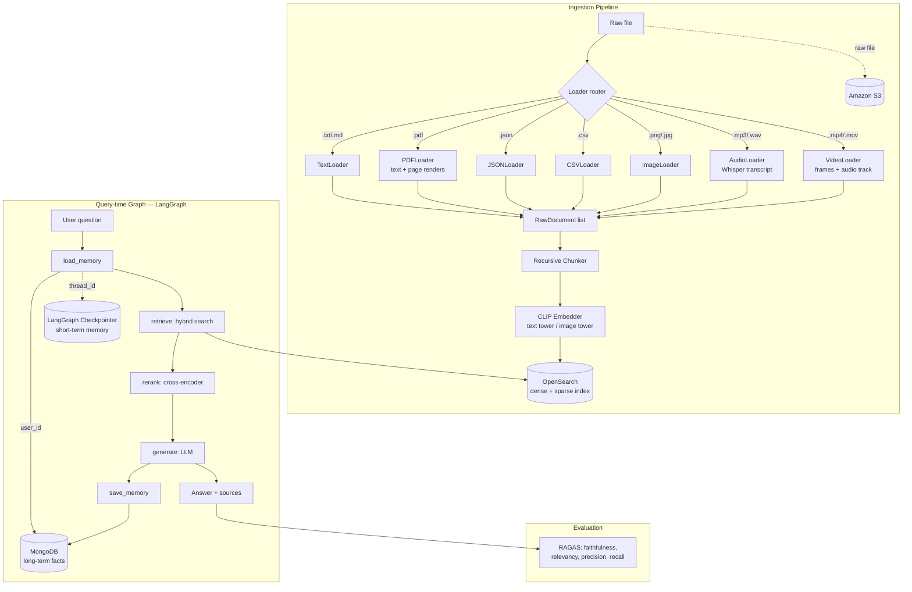
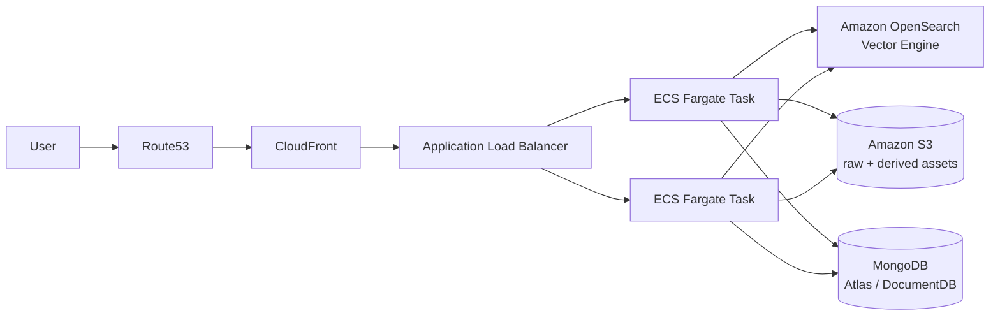

<div align="center">

#  Multimodal RAG

**One retrieval pipeline for text, PDF, JSON, CSV, images, audio, and video — hybrid search, cross-encoder reranking, RAGAS-evaluated, with short & long-term memory, deployed on AWS.**

[](https://www.python.org/)
[](https://fastapi.tiangolo.com/)
[](https://langchain-ai.github.io/langgraph/)
[](https://opensearch.org/)
[](https://www.docker.com/)
[](infra/AWS_DEPLOYMENT.md)
[](#license)

[Overview](#-overview) •
[Architecture](#-architecture) •
[Modules](#-modules-in-detail) •
[Quickstart](#-quickstart) •
[API](#-api-reference) •
[Config](#-configuration) •
[Deployment](#-aws-deployment) •
[Roadmap](#-roadmap)

</div>

---

## 📖 Overview

This repo is an end-to-end, production-shaped **multimodal Retrieval-Augmented
Generation (RAG)** system. A single query can retrieve relevant passages from
plain text, PDFs (including scanned pages/diagrams), JSON, CSV, images,
audio recordings, and video — all embedded into **one shared vector space**
with CLIP, retrieved with a **hybrid dense + sparse** search, sharpened with
a **cross-encoder reranker**, and answered with an LLM that has access to
both **short-term (conversation)** and **long-term (cross-session)** memory.
Answer quality is continuously measured with **RAGAS**.

| | |
|---|---|
|  **Modalities** | text · pdf · json · csv · image · audio · video |
|  **Retrieval** | Hybrid (dense kNN + BM25, score-fused) → cross-encoder rerank |
|  **Embedding** | Single CLIP model (`ViT-B-32`) for text *and* images |
|  **Orchestration** | LangGraph state machine |
|  **Memory** | Short-term: LangGraph checkpointer · Long-term: MongoDB |
|  **Evaluation** | Ragas — faithfulness, answer relevancy, context precision/recall |
|  **Serving** | FastAPI + Docker |
|  **Deployment** | ECS Fargate, ALB, CloudFront, Route53, S3, OpenSearch Vector Engine |
|  **Size** | ~911 lines of Python across 26 files |

---

##  Architecture

<details open>
<summary><strong>End-to-end data flow</strong></summary>



</details>

<details>
<summary><strong>AWS deployment topology</strong></summary>



</details>

---

##  Project Structure

```
multimodal-rag/
├── app/
│   ├── config.py                  # Central pydantic-settings config
│   ├── ingest.py                  # load → chunk → embed → index (+ S3 upload)
│   ├── graph.py                   # LangGraph pipeline: retrieve → rerank → generate
│   ├── loaders/
│   │   ├── base.py                # RawDocument + BaseLoader interface
│   │   ├── text_loader.py
│   │   ├── pdf_loader.py          # text + rasterized page images
│   │   ├── json_loader.py
│   │   ├── csv_loader.py          # batched rows
│   │   ├── image_loader.py
│   │   ├── audio_loader.py        # Whisper transcription
│   │   ├── video_loader.py        # frame sampling + audio extraction
│   │   └── __init__.py            # extension → loader registry
│   ├── chunking/
│   │   └── recursive_chunker.py   # RecursiveCharacterTextSplitter wrapper
│   ├── embeddings/
│   │   └── clip_embedder.py       # shared text/image CLIP embedding space
│   ├── retrieval/
│   │   ├── vector_store.py        # OpenSearch index mgmt + bulk indexing
│   │   ├── hybrid_retriever.py    # dense kNN + BM25, score-fused
│   │   └── reranker.py            # cross-encoder shortlist rerank
│   ├── memory/
│   │   ├── short_term.py          # LangGraph InMemorySaver checkpointer
│   │   └── long_term.py           # MongoDB user-fact store
│   ├── evaluation/
│   │   └── ragas_eval.py          # RAGAS metric harness
│   └── api/
│       └── main.py                # FastAPI: /ingest /query /evaluate /health
├── infra/
│   └── AWS_DEPLOYMENT.md          # ECR/ECS/ALB/CloudFront/Route53 runbook
├── Dockerfile
├── docker-compose.yml             # app + OpenSearch + MongoDB, local dev
├── requirements.txt
└── README.md
```

---

##  Modules in Detail

<details>
<summary><b>1. Loaders — <code>app/loaders/</code></b></summary><br>

Every loader normalizes its input into a shared `RawDocument`:

```python
@dataclass
class RawDocument:
    content: str            # text representation for embedding/BM25
    modality: str            # text | pdf | json | csv | image | audio | video
    source_path: str
    metadata: dict
    asset_path: str | None   # local path for CLIP image-tower embedding
```

| Loader | Extensions | Behavior |
|---|---|---|
| `TextLoader` | `.txt`, `.md` | Reads file as-is |
| `PDFLoader` | `.pdf` | Extracts text **per page**, *and* rasterizes each page to PNG so diagrams/scanned content are searchable via CLIP's image tower |
| `JSONLoader` | `.json` | Flattens records (optionally via a dotted JSONPath) into one doc per record |
| `CSVLoader` | `.csv` | Batches rows (default 20/chunk) to stay semantically coherent |
| `ImageLoader` | `.png`, `.jpg`, `.jpeg`, `.webp` | Stores asset path; optional captioner hook feeds BM25 |
| `AudioLoader` | `.mp3`, `.wav`, `.m4a` | Whisper transcription, full-text + per-segment (timestamped) |
| `VideoLoader` | `.mp4`, `.mov`, `.avi` | Samples frames every N seconds (image-tower) **and** extracts + transcribes the audio track |

Routing is automatic by file extension via `app/loaders/__init__.py::load_any()`.

</details>

<details>
<summary><b>2. Chunking — <code>app/chunking/recursive_chunker.py</code></b></summary><br>

Uses LangChain's `RecursiveCharacterTextSplitter`, which tries the largest
semantic boundary first (`\n\n` → `\n` → `. ` → `" "` → char-level) so chunks
stay coherent instead of splitting mid-sentence. Image-only `RawDocument`s
(no meaningful text body) pass through untouched — they're a single
embeddable unit, not something to split.

Defaults: `chunk_size=800`, `chunk_overlap=120` (tunable in `app/config.py`).

</details>

<details>
<summary><b>3. Embedding — <code>app/embeddings/clip_embedder.py</code></b></summary><br>

A single OpenCLIP model (`ViT-B-32`, `laion2b_s34b_b79k` weights) embeds
**every modality into the same 512-dim vector space**:

- Text tower → text, json, csv, transcripts
- Image tower → images, PDF page renders, video frames

This is what lets one OpenSearch kNN index cover all modalities — a text
query embedding is directly comparable to an image embedding, no separate
indices or fusion-by-metadata needed.

```python
embedder = get_embedder()
vectors = embedder.embed_documents(chunks)   # routes each chunk to the right tower
query_vec = embedder.embed_query("what does the chart on page 3 show?")
```

</details>

<details>
<summary><b>4. Retrieval — <code>app/retrieval/</code></b></summary><br>

**`vector_store.py`** — OpenSearch index with an `hnsw`/`cosinesimil`
`knn_vector` field alongside an analyzed `content` text field (powers BM25).

**`hybrid_retriever.py`** — runs dense kNN and sparse BM25 searches
independently, min-max normalizes each score list, then fuses:

```
fused_score = alpha * normalized_dense_score + (1 - alpha) * normalized_sparse_score
```

`alpha` (`hybrid_alpha` in config, default `0.5`) tunes the semantic/keyword
balance — raise it for conceptual questions, lower it for queries with
exact IDs, numbers, or proper nouns that dense embeddings tend to blur.

**`reranker.py`** — a cross-encoder (`ms-marco-MiniLM-L-6-v2` by default)
scores the top ~20-40 hybrid candidates as joint (query, passage) pairs —
much more accurate than embedding-similarity alone, but too slow to run
over a full corpus, so it's reserved for the shortlist.

</details>

<details>
<summary><b>5. Orchestration — <code>app/graph.py</code></b></summary><br>

A LangGraph `StateGraph` wires the whole query-time flow:

```
load_memory → retrieve → rerank → generate → save_memory
```

| Node | Responsibility |
|---|---|
| `load_memory` | Pulls long-term facts for `user_id` from MongoDB |
| `retrieve` | Hybrid search against OpenSearch |
| `rerank` | Cross-encoder rescoring of the shortlist |
| `generate` | Builds the grounded prompt and calls the LLM *(stub — see below)* |
| `save_memory` | Persists new long-term facts |

Short-term memory (message history across turns in one conversation) is
handled transparently by the LangGraph checkpointer, keyed on `thread_id`.

</details>

<details>
<summary><b>6. Memory — <code>app/memory/</code></b></summary><br>

| | Backend | Scope | Notes |
|---|---|---|---|
| **Short-term** | LangGraph `InMemorySaver` | Per `thread_id` (one conversation) | Fine for a single process; swap for a Redis/Postgres checkpointer before scaling ECS beyond one task without sticky sessions |
| **Long-term** | MongoDB | Per `user_id` (cross-session) | Simple key/value fact store today — see [Roadmap](#-roadmap) for extraction upgrade |

</details>

<details>
<summary><b>7. Evaluation — <code>app/evaluation/ragas_eval.py</code></b></summary><br>

Wraps [RAGAS](https://github.com/explodinggradients/ragas) to score
`(question, answer, retrieved_contexts, ground_truth)` tuples:

| Metric | Measures |
|---|---|
| `faithfulness` | Is the answer grounded in the retrieved context (no hallucination)? |
| `answer_relevancy` | Does the answer actually address the question? |
| `context_precision` | Is the retrieved context relevant / well-ranked? |
| `context_recall` | Did retrieval surface everything needed? *(requires ground truth)* |

Exposed at `POST /evaluate` and runnable standalone for CI regression checks.

</details>

<details>
<summary><b>8. API — <code>app/api/main.py</code></b></summary><br>

FastAPI app — see full [API Reference](#-api-reference) below.

</details>

---

##  Quickstart

```bash
git clone <this-repo>
cd multimodal-rag

# spins up FastAPI + OpenSearch + MongoDB
docker compose up --build
```

<details>
<summary>Ingest a file</summary>

```bash
curl -F "file=@sample.pdf" http://localhost:8000/ingest
```
```json
{ "filename": "sample.pdf", "chunks_indexed": 34 }
```
</details>

<details>
<summary>Ask a question</summary>

```bash
curl -X POST http://localhost:8000/query \
  -H "Content-Type: application/json" \
  -d '{
        "question": "What does the Q3 revenue chart show?",
        "user_id": "u1",
        "thread_id": "t1"
      }'
```
```json
{
  "answer": "...",
  "sources": [
    { "modality": "image", "source_path": "sample.pdf", "score": 0.87 },
    { "modality": "pdf", "source_path": "sample.pdf", "score": 0.81 }
  ]
}
```
</details>

<details>
<summary>Run a RAGAS evaluation</summary>

```bash
curl -X POST http://localhost:8000/evaluate \
  -H "Content-Type: application/json" \
  -d '{
        "questions": ["What is the refund policy?"],
        "answers": ["Refunds are available within 30 days of purchase."],
        "contexts": [["Our refund policy allows returns within 30 days."]],
        "ground_truths": ["Refunds within 30 days."]
      }'
```
</details>

---

## 🔌 API Reference

| Method | Path | Body | Returns |
|---|---|---|---|
| `GET` | `/health` | — | `{"status": "ok"}` |
| `POST` | `/ingest` | multipart `file` | `{filename, chunks_indexed}` |
| `POST` | `/query` | `{question, user_id, thread_id}` | `{answer, sources[]}` |
| `POST` | `/evaluate` | `{questions[], answers[], contexts[][], ground_truths[]?}` | RAGAS scores per row |

Interactive Swagger docs available at `/docs` once the service is running.

---

## ⚙️ Configuration

All settings live in `app/config.py` (pydantic-settings) and are overridable
via environment variables or a `.env` file.

<details>
<summary>Full settings table</summary>

| Variable | Default | Purpose |
|---|---|---|
| `clip_model_name` | `ViT-B-32` | OpenCLIP architecture |
| `clip_pretrained` | `laion2b_s34b_b79k` | OpenCLIP weight set |
| `embedding_dim` | `512` | Must match the CLIP variant |
| `chunk_size` / `chunk_overlap` | `800` / `120` | Recursive chunker |
| `opensearch_host` / `opensearch_port` | `localhost` / `9200` | Vector store |
| `opensearch_index` | `multimodal_rag` | Index name |
| `top_k_dense` / `top_k_sparse` | `20` / `20` | Candidates per leg pre-fusion |
| `hybrid_alpha` | `0.5` | Dense↔sparse fusion weight |
| `rerank_top_n` | `5` | Final context size after reranking |
| `cross_encoder_model` | `ms-marco-MiniLM-L-6-v2` | Reranker |
| `mongodb_uri` / `mongodb_db` | `mongodb://localhost:27017` / `rag_memory` | Long-term memory |
| `s3_bucket` / `aws_region` | — | Raw/derived asset storage |
| `anthropic_model` | `claude-sonnet-5` | Generation LLM |

</details>

---

## ☁️ AWS Deployment

Full runbook in [`infra/AWS_DEPLOYMENT.md`](infra/AWS_DEPLOYMENT.md), covering:

- [x] ECR image build & push
- [x] S3 bucket + IAM for raw/derived assets
- [x] Amazon OpenSearch Service (vector engine, k-NN enabled)
- [x] MongoDB Atlas / DocumentDB for long-term memory
- [x] ECS Fargate task + service behind an ALB (`/health` health check)
- [x] CloudFront distribution + Route53 alias record
- [x] Notes on scaling short-term memory beyond a single ECS task

---

## 🗺️ Roadmap

- [ ] Wire a live LLM call into `generate_node` (currently a placeholder string)
- [ ] Replace naive `save_memory_node` with real fact extraction (small LLM call / classifier) instead of storing the raw last question
- [ ] Swap `InMemorySaver` for a Redis/Postgres LangGraph checkpointer for multi-task ECS without sticky sessions
- [ ] Plug an image captioning model into `ImageLoader` so BM25/sparse search can reach image content, not just CLIP similarity
- [ ] Scheduled RAGAS regression evaluation (EventBridge + Fargate task) reporting to CloudWatch

---

## 📄 License

MIT — see `LICENSE`.
